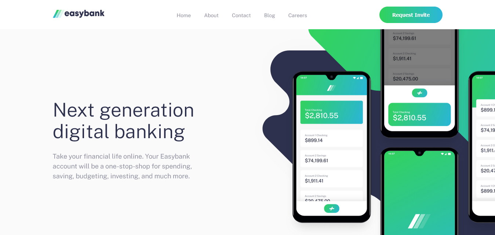
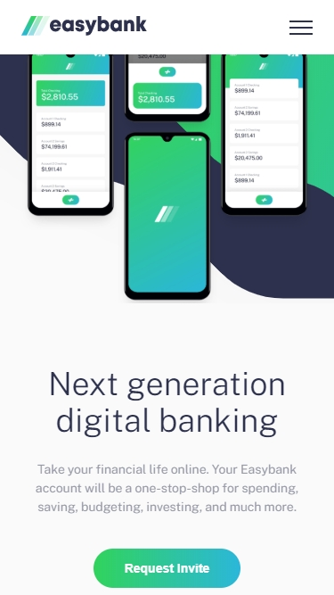

# Frontend Mentor - Easybank landing page solution

This is a solution to the [Easybank landing page challenge on Frontend Mentor](https://www.frontendmentor.io/challenges/easybank-landing-page-WaUhkoDN).  
Frontend Mentor challenges help you improve your coding skills by building realistic projects.
## Table of contents

- [Overview](#overview)
  - [The challenge](#the-challenge)
  - [Screenshot](#screenshot)
  - [Links](#links)
- [My process](#my-process)
  - [Built with](#built-with)

  - [Useful resources](#useful-resources)
- [Author](#author)

## Overview

### The challenge

Users should be able to:

- View the optimal layout for the site depending on their device's screen size
- See hover states for all interactive elements on the page

### Screenshot

Below there are two screenshots from the project. The first is the visualization if you're using a desktop and the second is the view from a mobile device.

Desktop view screenshot

Mobile view screenshot

### Links

- Solution URL: [SOLUTION ON FRONTEND MENTOR](https://www.frontendmentor.io/solutions/responsive-landing-page-built-using-scss-flexbox-and-css-grid-tyrnhpTYA)
- Live Site URL: [LIVE SITE](https://easy-bank-black.vercel.app/)

## My process

### Built with

- Semantic HTML5 markup
- CSS custom properties
- Flexbox
- CSS grid
- Mobile-first workflow

### Useful resources

- [CSS Tricks](https://css-tricks.com/) - Whenever i needed a deeper understanding on any css property and css best practices, this was my first destination.
- [StackOverflow](https://stackoverflow.com/) - With this site, I could solve some specific questions. So I also recommend getting a look at this type of forums before asking some questions.
- [FreeCodeCamp](https://www.freecodecamp.org/) - On this platform i was able to get much needed insights and solutions to this challenge

## Author

- Github - [Toni](https://github.com/toni-21/)
- Frontend Mentor - [Tones](https://www.frontendmentor.io/profile/toni-21)
